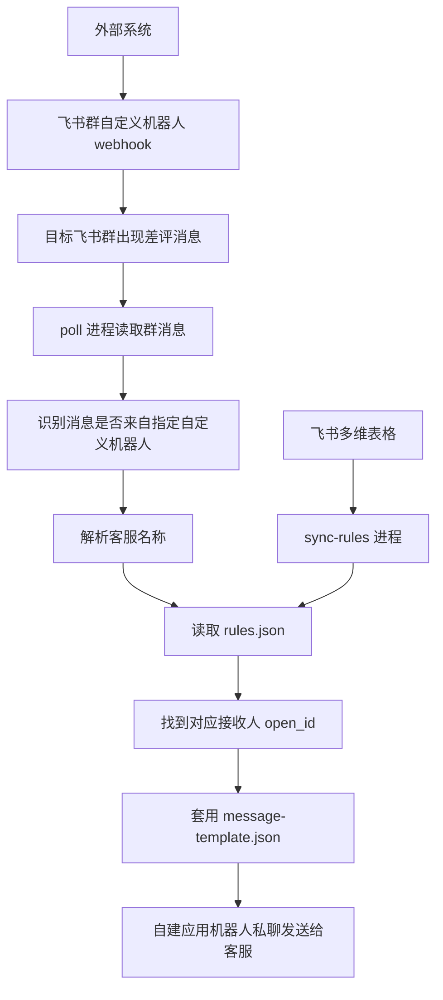

# 从调研到落地：一次飞书自动分发项目的 Vibe Coding 全流程教程

这份文档复盘的是 2026-05-19 这次与 Codex 一起完成的飞书自动分发项目。它不是单纯的代码说明，而是把“从发现问题、探索方案、不断试错，到最终做出可运行项目”的全过程拆开讲清楚。

适合阅读的人：

- 第一次接触飞书开放平台、自定义机器人、自建应用的人。
- 想学习如何和 Codex 一起做 Vibe Coding 的人。
- 想理解这个项目为什么最后会变成“群机器人 + 自建应用轮询 + 多维表格规则 + Windows 常驻运行”的人。

本文不会记录真实密钥、真实群 ID、真实人员 open_id 或真实多维表格 token。所有敏感值都用占位符表示。

## 1. 这次 Vibe Coding 的核心目标

最初的问题很朴素：

> 外部系统会发来差评消息，消息里包含不同客服名称。我希望飞书智能体或机器人收到 webhook 后，马上把对应消息发给对应客服。

一开始听起来像一个标准 webhook 转发需求：

```text
外部系统
  -> 我们自己的 webhook 服务
  -> 判断客服
  -> 发给对应飞书用户
```

但真正调研后发现，关键限制在这里：

> 外部系统只支持把消息发送到飞书群自定义机器人的 webhook 地址。公开文档里不要写出真实 webhook，本教程统一用“飞书群机器人 webhook 占位符”表示。

这意味着外部系统不能直接把消息发给我们自己的服务。它只能把消息推到飞书群里。

于是项目的核心目标变成：

```text
外部系统无法改 webhook 目标
所以先让它继续发到飞书群
再由我们自己的自建应用去“看群消息”
最后按客服名称分发给对应客服
```

## 2. Vibe Coding 的第一步：先澄清链路

刚开始最容易混淆的是“机器人”这个词。

飞书里至少有两类相关角色：

| 名称 | 位置 | 能做什么 | 在本项目中的作用 |
|---|---|---|---|
| 群自定义机器人 | 某个飞书群里添加 | 接收固定 webhook，把消息发到群里 | 接收外部系统消息 |
| 自建应用机器人 | 飞书开放平台自建应用 | 调用飞书 OpenAPI、读群消息、发私聊、读多维表格 | 自动识别和转发 |

一开始我们尝试把问题想象成“自建应用直接接收 webhook”。但用户补充后发现：

```text
外部系统只认飞书群自定义机器人 webhook
不能改成我们自己的 URL
```

所以最终链路必须改成：

```text
外部系统
  -> 飞书群自定义机器人 webhook
  -> 飞书群里出现消息
  -> 自建应用读取这个群的消息
  -> 识别客服名称
  -> 查规则
  -> 私聊发给对应客服
```

这一步的教学点是：不要急着写代码，先把“谁能收到什么、谁能发给谁”画清楚。Vibe Coding 不是靠感觉乱写，而是边聊边收敛真实边界。

## 3. 第二步：方案探索与转向

### 3.1 最初方案：自建服务接 webhook

最自然的方案是：

```text
外部系统 -> 自己的 HTTPS 服务 -> 飞书发消息
```

这个方案的优点：

- 实时性最好。
- 可以完全控制消息解析。
- 不依赖读取群消息。

但它有一个致命问题：

```text
外部系统不能填自己的 HTTPS 地址
只能填飞书自定义机器人 hook 地址
```

所以这个方案被放弃。

### 3.2 第二个方案：自建应用长连接监听群消息

接下来想到：

```text
飞书群出现自定义机器人消息
  -> 自建应用通过事件订阅/长连接收到消息事件
  -> 转发给用户
```

这看起来更接近“实时接收”。于是我们开始准备：

- 创建飞书自建应用。
- 开放读取群消息权限。
- 设置消息事件能力。
- 让应用加入目标群。
- 通过长连接测试是否能收到群里的自定义机器人消息。

这个阶段暴露了两个关键问题：

1. Codex 不知道要监听哪个群，需要用户提供目标群信息。
2. Codex 不知道用户创建的是哪个自建应用，需要用户提供应用的 App ID 和 App Secret。

所以我们开始整理 `.env`，让用户把必要信息填进去。

### 3.3 实测后转向：用轮询读取群消息更稳

长连接能处理事件，但在实际测试中，群自定义机器人发出的消息是否能稳定触发、权限是否完全满足、事件配置是否正确，都会带来不确定性。

为了让项目先跑通，我们最终选择了更直接、更可控的方式：

```text
自建应用每隔几秒主动读取目标群最近消息
```

这就是现在的 `poll` 方案。

它的优点：

- 不依赖外部系统改 webhook。
- 不依赖公网服务器。
- 不需要处理复杂的事件订阅回调。
- 适合放在公司 Windows 电脑上常驻运行。

它的代价：

- 不是绝对毫秒级实时，而是按轮询间隔触发。
- 电脑必须保持开机、联网、窗口不关闭。

项目默认轮询间隔是：

```text
POLL_INTERVAL_MS=5000
```

也就是大约 5 秒检查一次新消息。

## 4. 第三步：先做最小可行测试

在正式做规则系统前，我们先做了一个最小测试：

```text
群里出现自定义机器人消息
  -> 程序能不能看到这条消息
  -> 能不能把它转发给测试用户
```

早期用过的测试思路包括：

- 填用户自己的 `open_id`。
- 让程序把识别到的消息先发给自己。
- 用简单的测试消息验证收发链路。
- 观察控制台有没有读取到新消息。

当用户反馈“我已经接收到消息”时，说明核心链路已经成立：

```text
读群消息 -> 识别新消息 -> 发私聊
```

这一步很重要。因为如果一开始就做复杂规则、多维表格、Windows 脚本，任何一个地方错了都很难排查。先用最小路径跑通，后面每加一个功能才知道问题出在哪里。

## 5. 第四步：识别真正的业务难点

最开始以为难点是“怎么接 webhook”。但实际推进后发现，真正长期维护的难点是：

> 每个月会新增客服、修改客服信息，怎么方便地知道每个客服的 open_id？

手动收集 open_id 很快被证明不现实。

原因有三个：

- 你不是飞书企业管理员，不一定能方便查所有人的 open_id。
- 每月新增客服，人工维护容易漏。
- 客服本人也不知道自己的 open_id，收集成本高。

于是方案再次转向：不要让用户直接维护 `open_id`。

## 6. 第五步：用多维表格解决人员维护问题

最终的关键设计是：

```text
客服名称 -> 飞书多维表格“人员”字段 -> 程序自动拿到 open_id
```

也就是说，用户日常只需要在飞书多维表格里维护：

| 字段 | 类型 | 说明 |
|---|---|---|
| 客服名称 | 文本 | 差评消息里冒号后面的客服名 |
| 接收人 | 人员 | 在飞书人员字段里直接选人 |
| 是否启用 | 可选 | 控制这条规则是否生效 |

这样做有几个好处：

- 不需要用户知道 open_id。
- 新增客服只需要在表格里加一行。
- 修改接收人只需要改人员字段。
- 多个人接收同一个客服消息也可以扩展。

程序通过飞书多维表格 API 读取“人员”字段，拿到对应人的 open_id，然后生成本地缓存文件 `rules.json`。

这就是现在的规则同步进程：

```bash
npm run sync-rules
```

对应文件：

```text
src/sync-rules-from-base.js
```

## 7. 第六步：形成最终架构

最终项目由两个长期运行的进程组成。

### 7.1 规则同步进程

```text
飞书多维表格
  -> sync-rules 进程
  -> rules.json
```

它负责把多维表格里的规则同步到本地。

默认频率：

```text
RULES_SYNC_INTERVAL_MS=60000
```

也就是 60 秒同步一次。

### 7.2 消息轮询转发进程

```text
目标飞书群
  -> poll 进程
  -> 解析客服名称
  -> 查 rules.json
  -> 按 message-template.json 生成话术
  -> 私聊发送给客服
```

默认频率：

```text
POLL_INTERVAL_MS=5000
```

也就是 5 秒检查一次新消息。

最终架构图：



## 8. 第七步：消息如何被解析

假设群里出现这样的消息：

```text
差评
图拉斯旗舰店:图小静
2026-05-19 22:48:11
5
消费者自主评价
消息来自千牛自动化平台。 https://ability.taobao.com/
```

程序会重点找这一行：

```text
图拉斯旗舰店:图小静
```

冒号前面：

```text
图拉斯旗舰店
```

冒号后面：

```text
图小静
```

所以识别到的客服名称就是：

```text
图小静
```

中文冒号也可以识别：

```text
图拉斯旗舰店：图小静
```

如果冒号后面是两个字客服名，也可以识别。关键不是几个字，而是多维表格里的“客服名称”必须和消息里的客服名一致。

## 9. 第八步：把话术开放成 JSON

当基础分发跑通后，又出现一个新的需求：

> 我想方便地自定义发送话术，决定怎么推送这些变量。

于是我们把私聊消息模板抽成：

```text
message-template.json
```

用户日常可以只改这个文件，不需要改代码。

示例：

```json
{
  "lines": [
    "有新的差评需要处理",
    "",
    "客服：{{service_name}}",
    "店铺：{{store_name}}",
    "评分：{{rating}}",
    "",
    "{{message_text}}"
  ]
}
```

里面的 `{{service_name}}`、`{{store_name}}`、`{{rating}}` 会在发送时被替换成真实内容。

这一步的教学点是：当用户说“我以后要经常改”，就不要把内容写死在代码里。应该把它变成配置文件。

## 10. 第九步：Windows 运行适配

因为最终要放到公司 Windows 电脑上，所以项目不能只在开发者电脑上跑。

我们补了三个 Windows 启动文件：

| 文件 | 作用 |
|---|---|
| `windows-start-all.bat` | 一键启动两个工作窗口 |
| `windows-start-sync-rules.bat` | 只启动多维表格规则同步 |
| `windows-start-poll.bat` | 只启动群消息轮询转发 |

正式使用时双击：

```text
windows-start-all.bat
```

它会打开两个窗口：

```text
Feishu rules sync
Feishu message poll
```

两个窗口都要保持打开。

如果只开一个，就会出现：

| 只开什么 | 会发生什么 |
|---|---|
| 只开 `sync-rules` | 只会同步规则，不会转发消息 |
| 只开 `poll` | 可以转发，但多维表格改动不会自动生效 |

## 11. 第十步：真实排错过程

这次 Vibe Coding 的价值很大一部分来自排错。下面是几个实际遇到的问题。

### 11.1 `Missing required env: FEISHU_APP_ID`

含义：

```text
.env 里没有 FEISHU_APP_ID
```

解决方式：

1. 确认项目根目录有 `.env`。
2. 确认 `.env` 里写了：

```text
FEISHU_APP_ID=cli_xxxxx
FEISHU_APP_SECRET=xxxxx
```

3. 确认 Windows 启动脚本是在项目根目录运行的。

### 11.2 `Missing required env: TARGET_CHAT_ID`

含义：

```text
poll 进程不知道要监听哪个飞书群
```

解决方式是在 `.env` 里填写：

```text
TARGET_CHAT_ID=oc_xxxxx
```

这个值是目标群的 chat_id。

### 11.3 `Missing required env: RULES_BASE_APP_TOKEN`

含义：

```text
sync-rules 进程不知道要读哪个多维表格
```

解决方式是在 `.env` 里填写：

```text
RULES_BASE_APP_TOKEN=xxxxx
RULES_BASE_TABLE_ID=tblxxxxx
```

### 11.4 多维表格字段名乱码

曾经出现过类似：

```text
"serviceName": "瀹㈡湇鍚嶇О"
```

这通常是 Windows 编码或 `.env` 内容粘贴格式导致的。

解决方式：

- 确认 `.env` 文件保存为 UTF-8。
- 确认每个环境变量单独一行。
- 不要把多个变量粘在同一行。

错误示例：

```text
RULES_FIELD_RECEIVER=接收人?RULES_FIELD_ENABLED=是否启用
```

正确示例：

```text
RULES_FIELD_RECEIVER=接收人
RULES_FIELD_ENABLED=是否启用
```

### 11.5 多维表格 403 Forbidden

含义：

```text
自建应用没有权限读取这个多维表格
```

常见原因：

- 自建应用没有开通多维表格相关权限。
- 多维表格没有授权给这个应用。
- 应用权限改完后没有重新发布或重新授权。

解决方向：

1. 检查飞书开放平台应用权限。
2. 检查多维表格协作者/应用权限。
3. 确认 App ID 和 App Secret 是同一个自建应用的。

### 11.6 `WrongViewId`

含义：

```text
RULES_BASE_VIEW_ID 填错了
```

解决方式：

- 如果不确定 view_id，就先不要填。
- `.env` 里可以留空：

```text
RULES_BASE_VIEW_ID=
```

不填视图 ID 时，程序直接读取表里的记录。

## 12. 第十一步：清理旧方案

随着方案从“发给我自己测试”演进到“多维表格人员字段正式规则”，早期测试变量和旧脚本就不再需要。

我们清理掉了早期概念：

```text
TEST_RECEIVE_ID
TEST_RECEIVE_ID_TYPE
WATCH_SENDER_OPEN_ID
CUSTOMER_SERVICE_GROUP_CHAT_ID
```

原因是正式流程已经不再需要你的个人 open_id。

正式流程是：

```text
多维表格“接收人”字段
  -> 飞书 API 返回人员 open_id
  -> sync-rules 写入 rules.json
  -> poll 按 rules.json 发送
```

这一步的教学点是：项目完成后一定要清理旧方案，否则后续维护的人会分不清哪些配置还有效。

## 13. 第十二步：文档化

为了让小白也能维护，我们补充了多份文档：

| 文件 | 作用 |
|---|---|
| `README.md` | 日常操作指南 |
| `PROJECT_TECH_TUTORIAL.md` | 项目技术教程 |
| `BASE_RULES_GUIDE.md` | 多维表格规则维护说明 |
| `WINDOWS_GUIDE.md` | Windows 部署和运行说明 |
| `SECURITY.md` | 公开仓库安全说明 |

这一步很关键。能跑只是第一阶段，能被别人接手、能在下个月新增客服时继续维护，才算真的落地。

## 14. 第十三步：公开发布前脱敏

后来我们继续把项目上传到 GitHub，并做公开仓库脱敏。

公开仓库不能包含：

- `.env`
- `.state/`
- `rules.json`
- `node_modules/`
- 真实 App Secret
- 真实 chat_id
- 真实 open_id
- 真实多维表格 token

所以我们保留了：

```text
.env.example
rules.example.json
message-template.json
```

并忽略真实运行文件：

```text
.env
.state/
rules.json
node_modules/
```

这一步后来又沉淀成了一个 Codex Skill：

```text
github-public-publisher
```

它的目标是：

```text
脱敏审查 -> 补中文 README -> 创建公开 GitHub 仓库 -> 设置描述 -> 自动打 topics
```

## 15. 最终项目文件和职责

当前项目的核心文件如下：

| 文件 | 职责 |
|---|---|
| `src/load-env.js` | 加载 `.env` 环境变量 |
| `src/sync-rules-from-base.js` | 从飞书多维表格同步客服规则 |
| `src/poll-and-forward.js` | 读取群消息并按规则转发 |
| `.env.example` | 环境变量模板 |
| `rules.example.json` | 规则缓存示例 |
| `message-template.json` | 私聊话术模板 |
| `windows-start-all.bat` | Windows 一键启动两个进程 |
| `windows-start-sync-rules.bat` | Windows 单独启动规则同步 |
| `windows-start-poll.bat` | Windows 单独启动消息转发 |
| `package.json` | Node.js 命令和依赖 |
| `README.md` | 操作指南 |
| `PROJECT_TECH_TUTORIAL.md` | 技术教程 |
| `BASE_RULES_GUIDE.md` | 多维表格维护指南 |
| `WINDOWS_GUIDE.md` | Windows 使用指南 |
| `SECURITY.md` | 安全说明 |

正式运行时，本地还会生成：

| 文件 | 是否提交 GitHub | 说明 |
|---|---|---|
| `.env` | 否 | 真实密钥和真实配置 |
| `rules.json` | 否 | 多维表格同步出的人员 open_id |
| `.state/poll-state.json` | 否 | 已处理消息记录，避免重复发送 |
| `node_modules/` | 否 | 依赖目录，可用 `npm install` 重新生成 |

## 16. Vibe Coding 中 Codex 扮演的角色

这次不是一开始就有完整需求文档，而是边聊边发现真实问题。

Codex 的作用主要有四类：

### 16.1 把模糊需求拆成链路

用户最开始说“用飞书智能体接收 webhook”，但真实限制是外部系统只能发给飞书群自定义机器人。

Codex 需要不断追问和修正：

```text
谁发消息？
发到哪里？
谁能读取？
谁能转发？
需要发给谁？
规则谁维护？
运行在哪里？
```

### 16.2 用最小实验验证关键假设

项目没有一开始就写完整系统，而是先验证：

```text
能不能读群消息？
能不能识别自定义机器人消息？
能不能发私聊？
```

只有这些跑通后，才进入规则同步和 Windows 落地。

### 16.3 把用户维护成本转成产品设计

当用户说“每月新增客服，手动收集 open_id 不现实”，这不是一个小问题，而是产品设计问题。

最终方案不是继续让用户填 open_id，而是改成：

```text
用户在多维表格人员字段选人
程序自动拿 open_id
```

这就是把技术复杂度藏到程序里，把日常维护留给更熟悉的表格界面。

### 16.4 把临时脚本整理成可交付项目

后期做了：

- 清理旧变量。
- 删除旧测试脚本。
- 编写 README。
- 编写小白教程。
- 适配 Windows 启动。
- 加入话术模板。
- 公开 GitHub 前脱敏。
- 给仓库设置中文描述和 topics。

这一步决定了项目是“一次性脚本”还是“能长期用的工具”。

## 17. 这次流程里最重要的经验

### 17.1 先找真实约束，再写代码

如果没有发现“外部系统只能发飞书自定义机器人 webhook”，可能会浪费很多时间写一个完全用不上的中转服务。

### 17.2 先做最小闭环

最小闭环是：

```text
群消息 -> 程序看到 -> 私聊发出
```

这个闭环跑通后，后续每个功能都是加法。

### 17.3 用户不该维护机器 ID

`open_id`、`chat_id`、`app_token` 都是机器喜欢的东西，不是人喜欢的东西。

真正的日常维护界面应该是：

```text
客服名称
接收人
是否启用
```

也就是多维表格。

### 17.4 Windows 落地要从第一天考虑

如果最终运行环境是公司 Windows 电脑，就要考虑：

- CMD 能不能运行。
- `.env` 编码是否正确。
- 双击脚本是否能加载变量。
- 是否需要两个窗口。
- 电脑睡眠后会不会停止。

### 17.5 公开发布前必须脱敏

这个项目涉及飞书权限，公开 GitHub 前必须保证真实 `.env`、真实 `rules.json` 和真实状态文件不上传。

## 18. 如果重新做一遍，推荐流程

以后做类似项目，可以按这个顺序来：

1. 画出真实消息链路。
2. 确认外部系统 webhook 能不能改。
3. 如果不能改，就确认消息会进入哪个飞书群。
4. 创建飞书自建应用。
5. 给自建应用开通读群消息、发消息、多维表格读取权限。
6. 先做最小测试：读群消息并发给测试用户。
7. 加入自定义机器人来源过滤。
8. 解析消息里的业务字段。
9. 用多维表格维护人员规则。
10. 同步规则到本地缓存。
11. 加入消息状态文件，避免重复发送。
12. 加入话术模板文件，方便非程序员修改。
13. 写 Windows 启动脚本。
14. 写操作文档和排错文档。
15. 公开发布前脱敏和安全审查。

## 19. 当前最终运行方式

Windows 上日常运行：

```text
双击 windows-start-all.bat
```

保持两个窗口打开：

```text
Feishu rules sync
Feishu message poll
```

日常修改客服规则：

```text
改飞书多维表格
等待最多 60 秒
新规则自动同步到 rules.json
```

日常修改私聊话术：

```text
改 message-template.json
下一条新消息自动使用新模板
```

停止系统：

```text
关闭两个窗口
```

## 20. 结语

这次 Vibe Coding 的本质不是“让 Codex 替你写几段代码”，而是一起把一个模糊业务问题变成可运行、可维护、可交付的自动化系统。

真正的路径是：

```text
模糊需求
  -> 澄清限制
  -> 放弃不可行方案
  -> 最小实验
  -> 业务规则抽象
  -> 用户维护界面设计
  -> Windows 落地
  -> 文档化
  -> 脱敏公开
```

这也是这类自动化项目最值得学习的地方：代码只是结果，前面的调研、判断、试错、转向和整理，才是项目能不能真的跑起来的关键。
